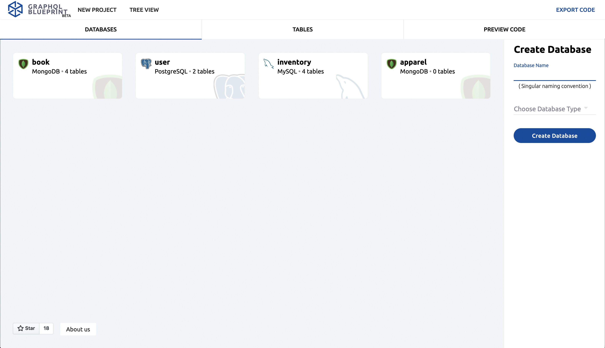

# GraphQL Blueprint

[GraphQL Blueprint](http://graphqlblueprint.xyz) helps you build full stack apps with boilerplate code. Currently on a React, Express, Apollo stack, you can template out GraphQL code by modeling your database schema with our easy-to-use interface.

Our interface provides you the ability, with a few simple inputs, to auto generate boilerplate code for download. As you can see in the video below, it resembles the activity of data modeling (another use case of GraphQL Blueprint). The boilerplate code gives you a head start to develop your new application including GraphQL root queries, schemas, mutations, and client queries. Also available for download are the NoSQL schemas or SQL build scripts, and a server file. Neat, right?


https://user-images.githubusercontent.com/5971166/126023310-2eefd773-9848-4f79-8760-1a3b86df954c.mp4


## Background

GraphQL is an open source data query and manipulation language that can be a preferred method over RESTful architecture, fulfilling queries with less API calls, and limiting over-fetching and under-fetching of data. Although GraphQL is a powerful query language, starting a new GraphQL application can be time consuming due to its redundant structure. This repetitive code can make developing a GraphQL application more intuitive, but this could also mean that for every GraphQL type created, a large amount of additional code would be required.

For example, adding a new GraphQL type "User" with the fields "id", "age", and "messages" may require the following:
- A root query for an individual User by id
- A root query for all the Users
- Mutation to create a User with an id, age, and messages
- Mutation to select a User by id, and update their age or messages
- Mutation to delete a User by id
- Client queries for User and the particular fields
- A NoSQL schema or SQL create script for User

You will notice that all these items revolve around a similar piece of information - User and its fields: id, age, and messages.

GraphQL Blueprint solves this repetition by requiring the developer just to enter the information once. Once a GraphQL type is created on this platform, root queries, mutations, client queries, and a NoSQL schema or SQL create script is auto generated and ready for download. After download, the code can be simply dragged and dropped into your code base or favorite text editor!

## How To Use

Visit [GraphQL Blueprint](http://graphqlblurprint.xyz/) and choose one or many database models to implement (MongoDB, PostgreSQL or MySQL). our application will generate the code for your database schemas, build scripts and GraphQL resolvers.

Next create a table for every GraphQL type your application will need. Each table created will also represent the structure of your NoSQL schema or SQL table. Each created table in our application can have several fields, which not only becomes a GraphQL field, but a SQL column or NoSQL key as well. 




The fields can be customized to meet your desired database structure, and using relations, can dynamically make the resolvers for each GraphQL type. By default at this point, our application can auto generate a server file, database setup code, and GraphQL types, root queries, mutations, and client queries.


Lastly export your code! The download folder will contain a readme file that describes the organization of the boilerplate code is organized and how to run it.

Check out our issues panel to learn how you can contribute and if you like our app, please give it a star!

## GraphQL Blueprint Authors

[Sean Yalda](https://www.linkedin.com/in/sean-yalda/)
[@seanathon](https://github.com/Seanathon)

[Ethan Yeh](https://www.linkedin.com/in/ethan-yeh-171391172/)
[@ehwyeh](https://github.com/ehwyeh)

[Kevin Berlanga](https://www.linkedin.com/in/kevinberlanga/)
[@kevinberlanga](https://github.com/kevinberlanga)

[Dylan Li](https://www.linkedin.com/in/dli107/) 
[@dylan2040](https://github.com/dylan2040)

[Newas Azad](https://wwwlinkedin.com/in/newas-azad-0b0152134/) [@nazad23](https://github.com/nazad23)


### GraphQL Blueprint is forked and iterated upon from a previous open source project called GraphQL Designer. 
More information: [GraphQL Designer](http://graphqldesigner.com/) is a prototyping tool to develop full-stack GraphQL applications. It allowed you to model one database schema. We expanded upon it by allowing a multi-database schema, syntax highlighting, graph view, and persistant state with local storage among other things.

### GraphQL Designer Authors

[James Sieu](https://www.linkedin.com/in/james-sieu/) [@jamessieu](https://github.com/jamessieu)

[Patrick Slagle](https://www.linkedin.com/in/patrickslagle/) [@patrickslagle](https://github.com/patrickslagle)

[Greg Shamalta](https://www.linkedin.com/in/gregory-shamalta/) [@grs83](https://github.com/grs83)

[Tsion Adefres](https://www.linkedin.com/in/tadefres/) [@Tsionad](https://github.com/Tsionad)

## Running Your Own Version

Add `webpack": "webpack --watch --hot` to package.json file in scripts for hot module reloading. After adding, be sure to uncomment out "devtool" and "watch" keys from webpack.config file. 

Be sure to undo above actions when creating pull request to pass Circle.Ci tests.

To start the server:
```
npm install
npm run pack
npm run server
```

## License

This project is licensed under the MIT License - see the [LICENSE.md](https://github.com/oslabs-beta/GraphQL-Blueprint/blob/main/LICENSE.md) file for details.
